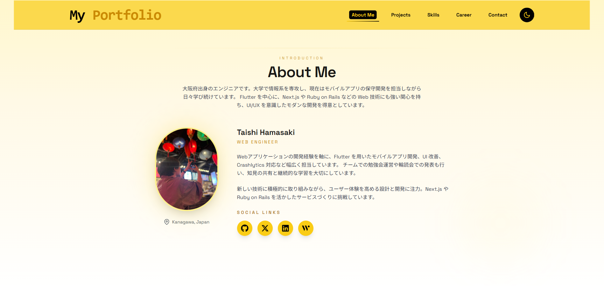

<div id="top"></div>

# My Portfolio

Taishi Hamasaki のポートフォリオサイトです。Next.js と Tailwind CSS をベースに、プロジェクトやスキル、経歴、コンタクト手段をわかりやすくまとめた自己紹介プラットフォームとして構築しています。

---

## 使用技術

<p style="display: inline">
  
  
  
  
  
  
  
</p>

---

## 目次

1. [概要](#概要)  
2. [環境](#環境)  
3. [セットアップ](#セットアップ)  
4. [ディレクトリ構成](#ディレクトリ構成)  
5. [スクリーンショット](#スクリーンショット)  
6. [ライセンス](#ライセンス)

---

## 概要

* モバイルアプリと Web アプリ開発の経験を中心に、**自己紹介 / プロジェクト / スキルセット / キャリア年表 / コンタクトフォーム** を 1 ページに整理した Next.js 14 製ポートフォリオサイト。
* **Hero セクションから About / Projects / Skills / Career / Contact** までの情報をシングルページで魅せる構成。【F\:app/page.tsx†L15-L58】【F\:app/components/About.tsx†L16-L113】
* **ダークモード対応のヘッダー**、スクロール位置検知、セクションハイライト、アクセシビリティ考慮のキーボードフォーカス制御などを備え、モダンな UI/UX を提供。【F\:app/components/Header.tsx†L11-L245】【F\:app/components/ThemeProvider.tsx†L14-L103】
* ページロード時には **Framer Motion を用いたイントロアニメーション / LoadingScreen** を表示し、没入感のある閲覧体験を演出。【F\:app/components/LoadingScreen.tsx†L1-L101】
* **Intersection Observer** と Framer Motion を活用し、スクロールに応じたアニメーション付きのカードやセクション表示を実現。【F\:app/components/Projects.tsx†L21-L142】【F\:app/components/Skills.tsx†L43-L251】【F\:app/components/Career.tsx†L6-L105】【F\:app/data/projects.js†L3-L59】
* **Nodemailer + Google reCAPTCHA**（任意利用）を組み合わせた問い合わせフォームを実装。スパム抑制のためレートリミット付き API で安全にメッセージを受け取れる設計。【F\:app/components/ContactForm.tsx†L17-L252】【F\:app/components/Recaptcha.tsx†L21-L58】【F\:app/api/email/route.tsx†L6-L79】
* **SEO メタデータと構造化データ**を共通の `SeoHead` コンポーネントで集中管理。Open Graph / Twitter カード / JSON-LD を適切に生成して検索エンジンと SNS での露出を最適化。【F\:app/page.tsx†L60-L89】【F\:app/components/SeoHead.tsx†L5-L234】【F\:app/layout.tsx†L1-L82】
* プロジェクト詳細は **動的ルーティング**で生成し、スラッグに基づいたタイトル・ディスクリプション・OGP を出力して SEO を強化。【F\:app/projects/\[slug]/page.tsx†L1-L141】

<p align="right">(<a href="#top">トップへ</a>)</p>

---

## 環境

| 項目 | バージョン |
| ---- | ---------- |
| Node.js | 18.18 以上 |
| Next.js | 14.2.x |
| React | 18.x |
| TypeScript | 5.x |
| Tailwind CSS | 3.4.x |
| npm | 10.x |

※ 詳細な依存関係は `package.json` を参照してください。【F:package.json†L1-L36】

---

## セットアップ

```bash
# リポジトリをクローン
git clone https://github.com/username/repository.git
cd repository

# 依存関係をインストール
npm install

# 環境変数を設定
cp .env.example .env.local  # ファイルがない場合は README の一覧を参考に新規作成してください

# 開発サーバーを起動
npm run dev
```

### 必須環境変数

| 変数名 | 説明 |
| ------ | ---- |
| `EMAIL_USER` | 送信元メールアドレス (SMTP ユーザー) |
| `EMAIL_PASS` | SMTP のアプリパスワードまたはアクセストークン |
| `RECIPIENT_EMAIL` | 問い合わせ内容を受信するメールアドレス |
| `RECAPTCHA_SECRET_KEY` | Google reCAPTCHA v2/v3 のシークレットキー。未設定の場合はフォーム送信が失敗します |
| `NEXT_PUBLIC_RECAPTCHA_SITE_KEY` | reCAPTCHA をフロントエンドで表示するためのサイトキー。未設定の場合はフォーム送信が失敗します |

> reCAPTCHA を正しく動作させるにはシークレットキーとサイトキーの両方を必ず設定してください。本番環境だけでなく `.env.local` にも同じ値を設定すると、ローカル開発時と本番環境で挙動の差異が出なくなります。Google reCAPTCHA の管理画面では **`your-domain.com` や `your-project.vercel.app` のようにプロトコルを含まない正しいドメイン名をサイトキーの「ドメイン」一覧に追加** してください。登録されていないホスト名からアクセスすると `サイトキーのドメインが無効です` というエラーになります。メール送信には Gmail 等の SMTP を利用でき、`EMAIL_PASS` にはアプリパスワードを推奨します。【F:app/components/ContactForm.tsx†L17-L247】【F:app/api/email/route.tsx†L6-L99】

<p align="right">(<a href="#top">トップへ</a>)</p>

---

## ディレクトリ構成

```
.
├── app/
│   ├── api/email/route.tsx        # Nodemailer + reCAPTCHA を用いた問い合わせ API
│   ├── components/                # UI コンポーネント (Header, About, Projects など)
│   ├── data/projects.js           # Works セクションのプロジェクトデータ
│   ├── hooks/useScrollDirection.js# ヘッダー表示を制御するカスタムフック
│   ├── layout.tsx                 # 全ページ共通レイアウトとテーマプロバイダー
│   └── page.tsx                   # トップページの構成
├── public/                        # 画像や OG 用のアセット
├── tailwind.config.ts             # Tailwind CSS の設定
├── next.config.js                 # Next.js の基本設定
└── package.json                   # 依存関係とスクリプト
```

<p align="right">(<a href="#top">トップへ</a>)</p>

---

## スクリーンショット

| トップページ |
| ------------ |
|  |

<p align="right">(<a href="#top">トップへ</a>)</p>

---

## ライセンス

本リポジトリのライセンスは未定です。利用・再配布の際はリポジトリ所有者にご確認ください。

<p align="right">(<a href="#top">トップへ</a>)</p>
