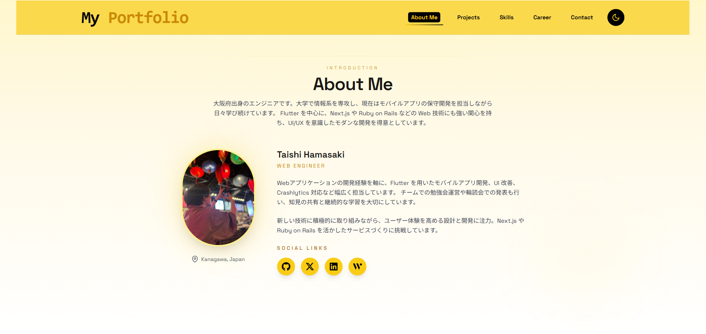

# My Portfolio

Taishi Hamasaki のポートフォリオサイトです。Next.js 14 と Tailwind CSS をベースに、プロジェクトやスキル、経歴、コンタクト手段をまとめた自己紹介用のウェブサイトを構築しています。

---

## 使用技術

<p style="display: inline">
  
  
  
  
  
  
  
  
</p>

---

## 目次

- [My Portfolio](#my-portfolio)
  - [使用技術](#使用技術)
  - [目次](#目次)
  - [概要](#概要)
  - [環境](#環境)
  - [セットアップ](#セットアップ)
    - [必須環境変数](#必須環境変数)
    - [任意環境変数](#任意環境変数)
  - [テスト](#テスト)
  - [ディレクトリ構成](#ディレクトリ構成)
  - [スクリーンショット](#スクリーンショット)
  - [ライセンス](#ライセンス)

---

## 概要

- モバイルアプリと Web アプリ開発の経験をもとに、自己紹介・プロジェクト・スキルセット・キャリア・コンタクトを 1 ページにまとめたポートフォリオサイトです。
- Hero セクションから About / Projects / Skills / Career / Contact までの情報をシングルページで表示します。
- ダークモード対応のヘッダーやスクロール位置によるセクションハイライトなど、モダンな UI/UX を意識しています。
- Framer Motion を利用したアニメーションやローディング画面を備え、スクロールに応じたインタラクションを実現しています。
- Nodemailer と reCAPTCHA を組み合わせた問い合わせフォームで、入力内容を検証したうえでメール送信できます。
- reCAPTCHA は invisible モードで実行し、badge を非表示にする代わりにフォーム内へ Google の Privacy Policy / Terms of Service 表記を表示しています。
- App Router の metadata / generateMetadata を利用し、共通 SEO、トップページ固有 SEO、プロジェクト詳細ページの OGP / Twitter metadata を出力します。
- Vercel Speed Insights と Web Analytics を導入し、パフォーマンスとアクセス状況をモニタリングできます。
- プロジェクト詳細は動的ルーティングで生成し、スラッグに基づいた説明文や OGP 画像を出力します。
- Vitest による問い合わせ API、reCAPTCHA 設定 API、プロジェクト詳細ページ、metadata の回帰テストを用意しています。

---

## 環境

| 項目         | バージョン |
| ------------ | ---------- |
| Node.js      | 18.18 以上 |
| Next.js      | 14.2.x     |
| React        | 18.x       |
| TypeScript   | 5.x        |
| Tailwind CSS | 3.4.x      |
| npm          | 10.x       |

詳細な依存関係は `package.json` を参照してください。

---

## セットアップ

```bash
# リポジトリをクローン
git clone https://github.com/hamasaki-code/My-portfolio.git
cd My-portfolio

# 依存関係をインストール
npm install

# 環境変数を設定
cp .env.example .env.local  # ファイルがない場合は README の一覧を参考に新規作成してください

# 開発サーバーを起動
npm run dev
```

### 必須環境変数

| 変数名                           | 説明                                                 |
| -------------------------------- | ---------------------------------------------------- |
| `NEXT_PUBLIC_RECAPTCHA_SITE_KEY` | reCAPTCHA の公開サイトキー                           |
| `RECAPTCHA_SECRET_KEY`           | reCAPTCHA の secret key                              |
| `MAIL_ACCOUNT`                   | SMTP ユーザー。未設定時は `AUTH_USER` / `EMAIL_USER` |
| `MAIL_PASSWORD`                  | SMTP パスワード。未設定時は `AUTH_PASS` / `EMAIL_PASS` |

### 任意環境変数

| 変数名                                | 説明                                                          |
| ------------------------------------- | ------------------------------------------------------------- |
| `MAIL_FROM`                           | 送信元メールアドレス。未設定時は SMTP ユーザーを使用          |
| `MAIL_TO`                             | 受信先メールアドレス。未設定時は `CONTACT_TO` / `RECIPIENT_EMAIL` / SMTP ユーザーを使用 |
| `SMTP_HOST` / `MAIL_HOST`             | SMTP サーバーのホスト名。未設定時は `smtp.gmail.com`          |
| `SMTP_PORT` / `MAIL_PORT`             | SMTP ポート番号。未設定時は `465`                             |
| `SMTP_SECURE` / `MAIL_SECURE`         | セキュア接続を使用するかどうか。未設定時は `true`             |
| `RECAPTCHA_VERIFY_TIMEOUT_MS`         | reCAPTCHA 検証リクエストのタイムアウト                        |
| `NEXT_PUBLIC_RECAPTCHA_SIZE`          | reCAPTCHA の表示サイズ。問い合わせフォームでは `invisible` を明示指定 |
| `NEXT_PUBLIC_RECAPTCHA_BADGE`         | invisible reCAPTCHA badge の位置。`bottomright` / `bottomleft` / `inline` |
| `TRUST_FORWARDED_IP_HEADERS`          | rate limit 用に forwarded IP header を信頼するかどうか        |
| `SMTP_ALLOW_SELF_SIGNED`              | SMTP の自己署名証明書を許可するかどうか                       |
| `SMTP_REJECT_UNAUTHORIZED`            | SMTP TLS 証明書検証を行うかどうか                             |

Gmail を利用する場合は 2 段階認証を有効にしたうえでアプリパスワードを `MAIL_PASSWORD` または `AUTH_PASS` に設定してください。その他の SMTP を利用する場合は `SMTP_HOST` や `SMTP_PORT` を上書きしてください。必須環境変数が不足している場合、問い合わせ API はエラーを返しメールは送信されません。

---

## テスト

```bash
# Vitest による API / metadata / smoke test
npm test

# 本番ビルドの確認
npm run build
```

CI でも `npm install` 後に `npm test` を実行すれば、ローカルと同じテストを確認できます。

---

## ディレクトリ構成

```
.
├── app/
│   ├── api/
│   │   ├── recaptcha-config/route.ts # reCAPTCHA の公開設定を返す API
│   │   └── sendmail/route.ts         # 問い合わせ内容を検証しメール送信する API
│   ├── components/                   # UI コンポーネント
│   ├── data/projects.js              # プロジェクトデータ
│   ├── hooks/useScrollDirection.js   # ヘッダー表示を制御するカスタムフック
│   ├── projects/[slug]/page.tsx      # プロジェクト詳細ページと generateMetadata
│   ├── globals.css                   # グローバルスタイル
│   ├── layout.tsx                    # 共通 layout / metadata / viewport
│   └── page.tsx                      # トップページ
├── lib/
│   ├── recaptcha.ts                  # reCAPTCHA 設定 helper
│   ├── seo.ts                        # SEO 定数と metadata helper
│   └── site.ts                       # サイト URL 定数
├── public/                           # 画像、favicon、sitemap、robots
├── tests/                            # Vitest のテスト
├── vitest.config.ts                  # Vitest 設定
├── tailwind.config.ts                # Tailwind CSS 設定
├── next.config.js                    # Next.js 設定
└── package.json                      # 依存関係とスクリプト
```

---

## スクリーンショット

| トップページ                          |
| ------------------------------------- |
|  |

---

## ライセンス

本リポジトリのライセンスは未定です。利用・再配布の際はリポジトリ所有者にご確認ください。
