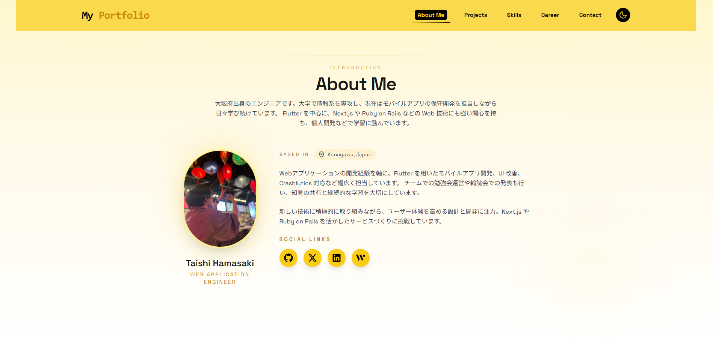

# My Portfolio

Taishi Hamasaki のポートフォリオサイトです。Next.js 14 と Tailwind CSS をベースに、プロジェクトやスキル、経歴、コンタクト手段をまとめた自己紹介用のウェブサイトを構築しています。

---

## 使用技術

<p style="display: inline">
  
  
  
  
  
  
  
</p>

---

## 目次

- [My Portfolio](#my-portfolio)
  - [使用技術](#使用技術)
  - [目次](#目次)
  - [概要](#概要)
  - [環境](#環境)
  - [セットアップ](#セットアップ)
    - [必須環境変数](#必須環境変数)
  - [ディレクトリ構成](#ディレクトリ構成)
  - [スクリーンショット](#スクリーンショット)
  - [ライセンス](#ライセンス)

---

## 概要

- モバイルアプリと Web アプリ開発の経験をもとに、自己紹介・プロジェクト・スキルセット・キャリア・コンタクトを 1 ページにまとめたポートフォリオサイトです。
- Hero セクションから About / Projects / Skills / Career / Contact までの情報をシングルページで表示します。
- ダークモード対応のヘッダーやスクロール位置によるセクションハイライトなど、モダンな UI/UX を意識しています。
- Framer Motion を利用したアニメーションやローディング画面を備え、スクロールに応じたインタラクションを実現しています。
- Nodemailer と Yup を組み合わせた問い合わせフォームで、安全にメール送信ができます。
- SEO メタデータと構造化データを共通コンポーネントで管理し、SNS や検索エンジンでの露出を高めています。
- Vercel Speed Insights と Web Analytics を導入し、パフォーマンスとアクセス状況をモニタリングできます。
- プロジェクト詳細は動的ルーティングで生成し、スラッグに基づいた OGP や説明文を出力します。

---

## 環境

| 項目         | バージョン |
| ------------ | ---------- |
| Node.js      | 18.18 以上 |
| Next.js      | 14.2.x     |
| React        | 18.x       |
| TypeScript   | 5.x        |
| Tailwind CSS | 3.4.x      |
| npm          | 10.x       |

詳細な依存関係は `package.json` を参照してください。

---

## セットアップ

```bash
# リポジトリをクローン
git clone https://github.com/username/repository.git
cd repository

# 依存関係をインストール
npm install

# 環境変数を設定
cp .env.example .env.local  # ファイルがない場合は README の一覧を参考に新規作成してください

# 開発サーバーを起動
npm run dev
```

### 必須環境変数

| 変数名               | 説明                                                 |
| -------------------- | ---------------------------------------------------- |
| `AUTH_USER`          | 送信元兼受信先のメールアドレス (SMTP ユーザー)       |
| `AUTH_PASS`          | SMTP のアプリパスワードまたはアクセストークン        |
| `SMTP_HOST` (任意)   | SMTP サーバーのホスト名。未設定時は `smtp.gmail.com` |
| `SMTP_PORT` (任意)   | SMTP ポート番号。未設定時は `465`                    |
| `SMTP_SECURE` (任意) | セキュア接続を使用するかどうか。未設定時は `true`    |

> Gmail を利用する場合は 2 段階認証を有効にしたうえでアプリパスワードを `AUTH_PASS` に設定してください。その他の SMTP を利用する場合は `SMTP_HOST` や `SMTP_PORT` を上書きすれば動作します。環境変数が不足している場合、API は 500 エラーを返しメールは送信されません。

---

## ディレクトリ構成

```
.
├── app/
│   ├── api/contact/route.ts       # Yup でリクエストを検証しメール送信する問い合わせ API
│   ├── server/contact.ts          # クライアントから API を呼び出すユーティリティ
│   ├── server/email.ts            # Nodemailer の設定と送信ロジック
│   ├── components/                # UI コンポーネント (Header, About, Projects など)
│   ├── data/projects.js           # Works セクションのプロジェクトデータ
│   ├── hooks/useScrollDirection.js# ヘッダー表示を制御するカスタムフック
│   ├── layout.tsx                 # 全ページ共通レイアウトとテーマプロバイダー
│   └── page.tsx                   # トップページの構成
├── public/                        # 画像や OGP 用のアセット
├── tailwind.config.ts             # Tailwind CSS の設定
├── next.config.js                 # Next.js の基本設定
└── package.json                   # 依存関係とスクリプト
```

---

## スクリーンショット

| トップページ                          |
| ------------------------------------- |
|  |

---

## ライセンス

本リポジトリのライセンスは未定です。利用・再配布の際はリポジトリ所有者にご確認ください。
